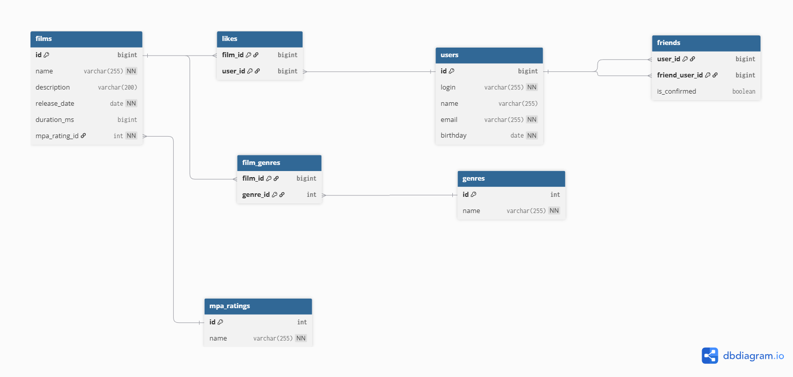

# java-filmorate Спринт 11
### Студент Лютов Сергей, кагорта 69
## Модель ДБ


*   **users**: данные о пользователях
*   **friends**: данные о друзьях пользователя. При реализации "дружбы"
 необходимо учесть необходимость взаимной регистрации дружбы.
*   **likes**: данные о лайках фильмов, осуществленных пользователями
*   **films**: данные о фильмах
*   **film_genres**: реализация связи многие-ко-многим для фильмов и справочника жанров
*   **genres**:  справочник жанров
*   **mpa_ratings**:  справочник MPA рейтингов
## DBML
```sql
Table users {
  id bigint [pk, increment]
  login varchar(255) [not null, unique]
  name varchar(255)
  email varchar(255) [not null, unique]
  birthday date [not null]
}

Table friends {
  user_id bigint 
  friend_user_id bigint
  is_confirmed boolean [default: false]
  indexes {
    (user_id, friend_user_id) [pk]
  }
}

Table genres {
  id int [pk, increment]
  name varchar(255) [not null, unique]
}

Table mpa_ratings {
  id int [pk, increment]
  name varchar(255) [not null, unique]
}

Table films {
  id bigint [pk, increment]
  name varchar(255) [not null]
  description varchar(200)
  release_date date [not null]
  duration_ms bigint
  mpa_rating_id int [not null] // Рейтинг обычно один на фильм
}

// Nаблица связей для жанров
Table film_genres {
  film_id bigint
  genre_id int
  indexes {
    (film_id, genre_id) [pk]
  }
}

Table likes {
  film_id bigint
  user_id bigint
  indexes {
    (film_id, user_id) [pk]
  }
}

// СВЯЗИ
Ref: friends.user_id > users.id [delete: cascade]
Ref: friends.friend_user_id > users.id [delete: cascade]
Ref: likes.film_id > films.id [delete: cascade]
Ref: likes.user_id > users.id [delete: cascade]
Ref: film_genres.film_id > films.id [delete: cascade]
Ref: film_genres.genre_id > genres.id [delete: restrict] // Не даем удалить жанр, если он нужен фильму
Ref: films.mpa_rating_id > mpa_ratings.id [delete: restrict]
```
## 🛠 Ключевые запросы

### Топ-10 фильмов по лайкам
```sql
SELECT f.name, COUNT(l.user_id) AS likes_cnt
FROM films f
LEFT JOIN likes l ON f.id = l.film_id
GROUP BY f.id ORDER BY likes_cnt DESC LIMIT 10;
```
### Список друзей пользователя с логином Ivanov (подтвердивших дружбу)
```sql
SELECT *
FROM users u
JOIN friends f ON u.id = f.friend_user_id
JOIN users owner ON f.user_id = owner.id
WHERE owner.login = 'Ivanov' 
  AND f.is_confirmed = TRUE;
```
