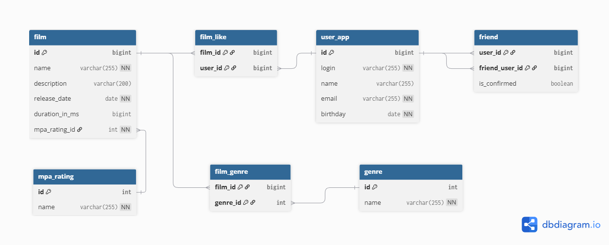

# java-filmorate Спринт 12 промежуточный 
### Студент Лютов Сергей, кагорта 69
## Модель ДБ


*   **user**: данные о пользователях
*   **friend**: данные о друзьях пользователя. При реализации "дружбы"
 необходимо учесть необходимость взаимной регистрации дружбы.
*   **film_like**: данные о лайках фильмов, осуществленных пользователями
*   **film**: данные о фильмах
*   **film_genre**: реализация связи многие-ко-многим для фильмов и справочника жанров
*   **genre**:  справочник жанров
*   **mpa_rating**:  справочник MPA рейтингов
## DBML
```sql
Table user_app {
  id bigint [pk, increment]
  login varchar(255) [not null, unique]
  name varchar(255)
  email varchar(255) [not null, unique]
  birthday date [not null]
}

Table friend {
  user_id bigint 
  friend_user_id bigint
  is_confirmed boolean [default: false]
  indexes {
    (user_id, friend_user_id) [pk]
  }
}

Table genre {
  id int [pk, increment]
  name varchar(255) [not null, unique]
}

Table mpa_rating {
  id int [pk, increment]
  name varchar(255) [not null, unique]
}

Table film {
  id bigint [pk, increment]
  name varchar(255) [not null]
  description varchar(200)
  release_date date [not null]
  duration_in_ms bigint
  mpa_rating_id int [not null] // Рейтинг обычно один на фильм
}

// Nаблица связей для жанров
Table film_genre {
  film_id bigint
  genre_id int
  indexes {
    (film_id, genre_id) [pk]
  }
}

Table film_like {
  film_id bigint
  user_id bigint
  indexes {
    (film_id, user_id) [pk]
  }
}

// СВЯЗИ
Ref: friend.user_id > user_app.id [delete: cascade]
Ref: friend.friend_user_id > user_app.id [delete: cascade]
Ref: film_like.film_id > film.id [delete: cascade]
Ref: film_like.user_id > user_app.id [delete: cascade]
Ref: film_genre.film_id > film.id [delete: cascade]
Ref: film_genre.genre_id > genre.id [delete: restrict] // Не даем удалить жанр, если он нужен фильму
Ref: film.mpa_rating_id > mpa_rating.id [delete: restrict]
```
## 🛠 Ключевые запросы

### Топ-10 фильмов по лайкам
```sql
SELECT f.name, COUNT(l.user_id) AS likes_cnt
FROM film f
LEFT JOIN film_like l ON f.id = l.film_id
GROUP BY f.id ORDER BY likes_cnt DESC LIMIT 10;
```
### Список друзей пользователя с логином Ivanov (подтвердивших дружбу)
```sql
SELECT *
FROM user u
JOIN friend f ON u.id = f.friend_user_id
JOIN user owner ON f.user_id = owner.id
WHERE owner.login = 'Ivanov' 
  AND f.is_confirmed = TRUE;
```
### Список фильмов с жанром Комедия
```sql
SELECT *
FROM film f
JOIN film_genre fg ON f.id = fg.film_id
JOIN genre g ON fg.genre_id = g.id
WHERE g.name = 'Комедия';
```
